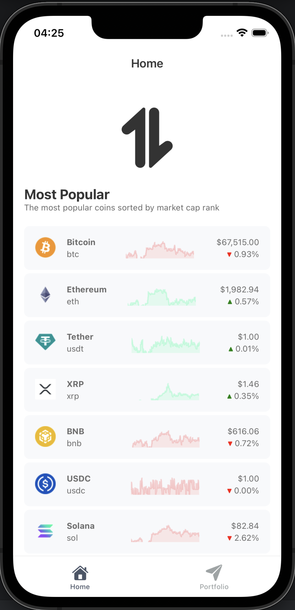
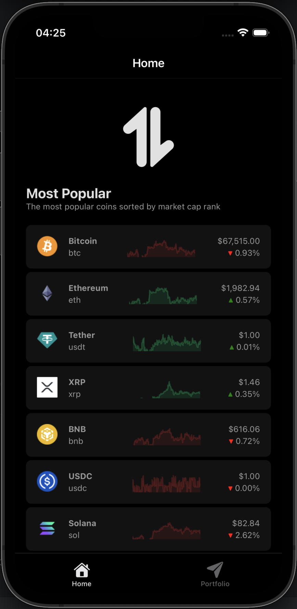
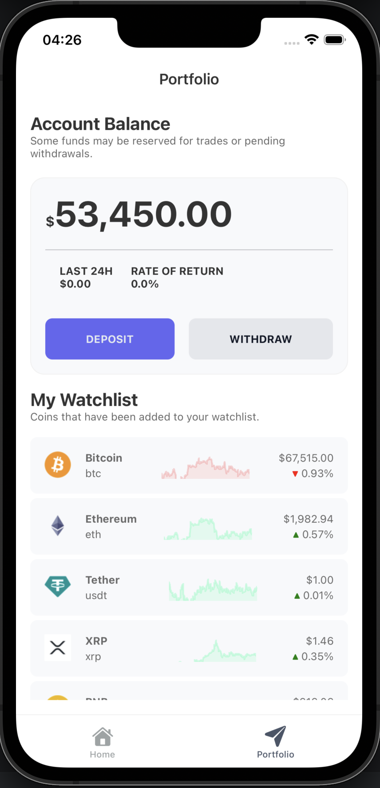
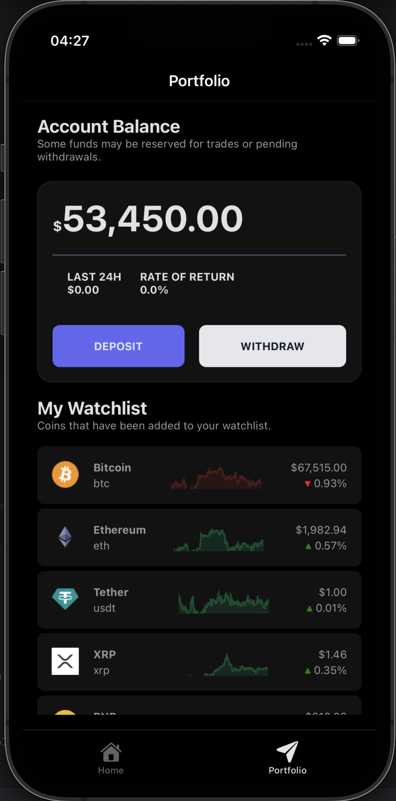

# A Showcase React Native Trading App

A **React Native app** that provides a clean, intuitive way to browse markets across **Crypto, Forex, and Stocks**.  
Designed to showcase **mobile UI, API integration, and data handling skills**, simulating a lightweight trading dashboard.
Can be used as starting point for your next project or for showcase purposes.

---
## Development

- **React Native**
- **Expo**
- **CoinGecko**

For all packages and dependencies, please refer to `package.json`.

---

## Features

Preview of the app in action, for now, showcasing the home screen and portfolio screen in light and dark mode.

- **Home screen** with most popular coins
    
  
    
  
    

- **Portfolio screen** with account balance and watchlist
    
  
    
  

---

## Features

- **Authentication:** Auth0 integration for secure login
- **Market Categories:** Crypto, Forex, commodities 
- **Live Data Simulation:** Current price, 24h % change (color-coded)
- **Search & Filter:** Quickly find instruments across categories
- **My Watchlist:** Save favorite instruments for quick access
- **Modal View:** when an instrument is clicked, show detailed info in a modal (charts, price, change, volume, etc.)
- **Dark Mode Ready:** Modern trading app aesthetics
- **API Integration:** Fetch real-time market data from free APIs using a python's FastAPI backend.

---

## Features To Implement
- **Authentication:** enable local host login with Auth0
- **Market Categories:** Forex, Stocks
- **Live Data Simulation**
- **Search & Filter:** Implement search functionality to filter instruments by name or symbol.
- **My Watchlist:** Allow users to add/remove instruments from their watchlist and persist it locally or API.
- **Modal View:** When an instrument is clicked, display a modal with detailed information, including charts, price, change, volume, etc.
- **API Integration**

---

## Design Inspiration

UI inspired by apps like **TradingView** and **Trading212**, drawing design inspiration from **Behance** and **Dribble**.  
Screenshots can be added here once implemented.

---

## Tech Stack

- **React Native** – Mobile framework
- **Axios / Fetch API** – Fetch market data
- **React Navigation** – Screen navigation
- **State Management** – Context API or Zustand
- **Open APIs** – Free market data for crypto, forex, and commodities
- **Auth0** – Authentication
- **FastAPI** – Backend to fetch and serve market data

---

## Getting Started
1. Clone the repository
2. Install dependencies: `npm install` or `yarn install`
3. Set up Auth0 credentials and API keys
4. Run the app: `npm start` or `yarn start`
5. Use Expo Go or an emulator to view the app on your device
6. Switch between light and dark mode to see the design in action
